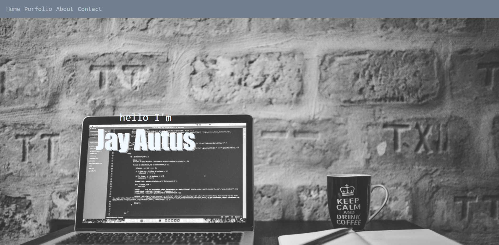

# Updated Portfolio

This is an updated portfolio as part of building toward being employer-competitive.

## Description

This homework helped me create a weather dashboard application that uses the [OpenWeather One Call API](https://openweathermap.org/api/one-call-api) to retrieve weather data for cities. This app runs in the browser and features dynamically updated HTML, CSS and jQuery. Using `localStorage` to store any persistent data.

Updating initial portfolio page to include Project #1 and the homework assignments as follows: Password Generator, Timed Code Quiz, Weather Dashboard and Work Day Scheduler; GitHub profile is updated with pinned repositories featuring Project 1 with (2) of exemplary assignments; Updated resume and LinkedIn profile to include current progress in the coding boot camp to build toward being employer-competitiveness.

Being part of the web developer community means show casing and sharing projects towards applying for jobs and is a part of the journey as a developer.

## Installation

1. Download or clone repository
2. Open the main page (index.html) on your browser to view webpage
3. On the main page, you can click on the links on top left to go to the location in the page for portfolio, about and contact

## Features

* Displaying full name with contact information including email and phone number
* Links to GitHub profile and LinkedIn profile
* A Link to a downloadable PDF of resume
* Project 1 and exemplary homework assignments including the following:
  * Screenshot of the deployed application
  * Title
  * Link to the deployed version
  * Link to the GitHub repository
* Polished, mobile-responsive user interface

## Technologies Used

* HTML
* CSS
* Bootstrap
* JavaScript

## Demo

## Website & Repository

* Github: <https://github.com/jak3ster/My-Updated-Porfolio-Page>
* Deployed: <https://jak3ster.github.io/My-Updated-Porfolio-Page>
